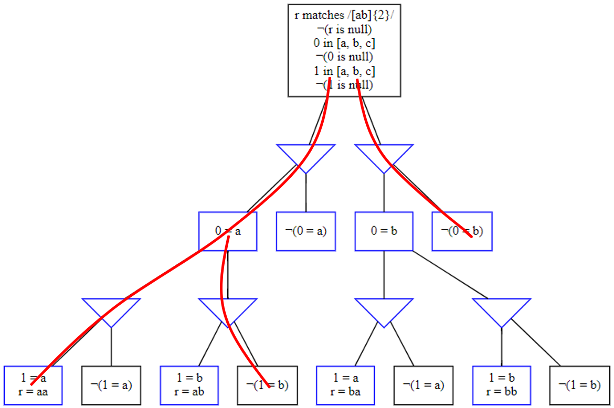

# Decision tree generation

Given a set of rules, generate a [decision tree](../decisionTrees/DecisionTrees.md) (or multiple if [partitioning](../decisionTrees/Optimisation.md#Partitioning) was successful).

## Decision tree interpretation

An interpretation of the decision tree is defined by chosing an option for every decision visited in the tree.



In the above diagram the red lines represent one interpretation of the graph, for every decision an option has been chosen and we end up with the set of constraints that the red lines touch at any point. These constraints are reduced into a fieldspec (see [Constraint Reduction](#constraint-reduction) below).

Every decision introduces new interpretations, and we provide interpretations of every option of every decision chosen with every option of every other option. If there are many decisons then this can result in too many interpretations.

# Constraint reduction

An interpretation of a decision tree could contain several atomic constraints related to a single field. To make it easier to reason about these collectively, we **reduce** them into more detailed, holistic objects. These objects are referred to as **fieldspecs**, and can express any restrictions expressed by a constraint. For instance, the constraints:

* `X greaterThanOrEqualTo 3`
* `X lessThanEqualTo 6`
* `X not null`

could collapse to

```
{
  min: 3,
  max: 6,
  nullability: not_null
}
```

*(note: this is a conceptual example and not a reflection of actual object structure)* 

See [Set restriction and generation](../../user/SetRestrictionAndGeneration.md) for a more in depth explanation of how the constraints are merged and data generated.

This object has all the information needed to produce the values `[3, 4, 5, 6]`.

The reduction algorithm works by converting each constraint into a corresponding, sparsely-populated fieldspec, and then merging them together. During merging, three outcomes are possible:

* The two fieldspecs specify distinct, compatible restrictions (eg, `X is not null` and `X > 3`), and the merge is uneventful
* The two fieldspecs specify overlapping but compatible restrictions (eg, `X is in [2, 3, 8]` and `X is in [0, 2, 3]`), and the more restrictive interpretation is chosen (eg, `X is in [2, 3]`).
* The two fieldspecs specify overlapping but incompatible restrictions (eg, `X > 2` and `X < 2`), the merge fails and the interpretation of the decision tree is rejected

# Databags

A **databag** is an immutable mapping from fields to outputs, where outputs are a pairing of a *value* and *formatting information* (eg, a date formatting string or a number of decimal places).

Databags can be merged, but merging two databags fails if they have any keys in common.

Fieldspecs are able to produce streams of databags containing valid values for the field they describe. Additional operations can then be applied over these streams, such as:

* A memoization decorator that records values being output so they can be replayed inexpensively
* A filtering decorator that prevents repeated values being output
* A merger that takes multiple streams and applies one of the available [combination strategies](../../user/CombinationStrategies.md)
* A concatenator that takes multiple streams and outputs all the members of each

# Output

Once fieldspecs have generated streams of single-field databags, and databag stream combiners have merged them together, we should have a stream of databags that each contains all the information needed for a single datum. At this point, a serialiser can take each databag in turn and create an output. For instance,

## CSV

Given a databag, iterate through the fields in the profile, in order, and lookup values from the databag. Create a row of output from those values.
